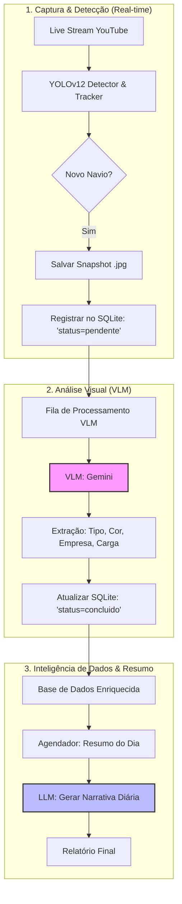

# Fluxograma do Sistema V2 - Maritime Intelligence (VLM & Summary)

Este diagrama expande o escopo original, introduzindo a camada de análise visual inteligente (VLM) e a geração de resumos automáticos.

### Novas Etapas do Projeto:

1.  **Status de Processamento:** As detecções agora possuem um campo `processed_by_vlm` no banco para garantir que cada imagem seja analisada apenas uma vez.
2.  **Módulo VLM (Vision Language Model):** Um novo componente que "lê" a imagem salva e converte pixels em metadados textuais (ex: "Navio cargueiro azul da Maersk").
3.  **Módulo Summarizer:** Um script que consolida todos os textos gerados pela VLM em um único parágrafo ou relatório executivo sobre as atividades do dia no Porto de Santos.
4.  **Base Enriquecida:** O SQLite agora armazena não apenas "quando" e "onde", mas "o que" exatamente foi visto.
