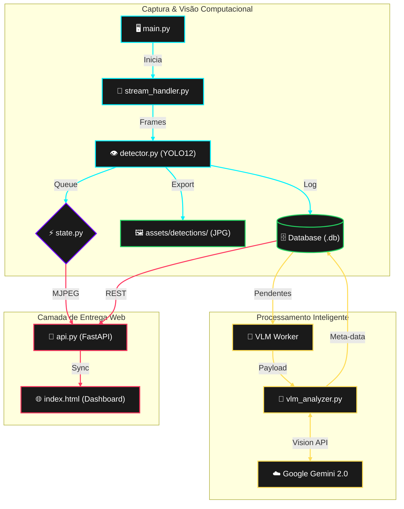

# 🚢 Santos Maritime Intelligence LLM v2.0

Sistema avançado de monitoramento portuário que utiliza Visão Computacional de última geração (**YOLO12**) e Modelos de Linguagem Visual (**Gemini 2.0**) para identificar, rastrear e analisar o tráfego de navios no Porto de Santos em tempo real.

---

## 📸 Demonstração do Sistema

> **[Adicionar imagens do funcionamento mais resultados do sistema]**
---

## 🛠️ Tecnologias Utilizadas

- **Core:** Python 3.12+
- **Visão Computacional:** Ultralytics YOLO12 (Tracking & Detection)
- **IA Generativa:** Google Gemini 2.0 (VLM - Vision Language Model)
- **Backend:** FastAPI (Streaming MJPEG & REST API)
- **Frontend:** HTML5/CSS3 (Glassmorphism Design) & JavaScript (Real-time Pooling)
- **Banco de Dados:** SQLite3 com persistência de tracks
- **Processamento:** Multithreading para análise paralela de imagens

---

## 🚀 Como Rodar o Projeto

### 1. Requisitos Prévios
- Chave de API do Google Gemini (obtida no Google AI Studio)
- Ambiente Virtual Python configurado

### 2. Configuração
Crie um arquivo `.env` na raiz do projeto:
```env
GOOGLE_API_KEY=sua_chave_aqui
VLM_MODEL_NAME=gemini-2.0-flash-exp
```

### 3. Instalação
```powershell
pip install -r requirements.txt
```

### 4. Execução
O sistema é integrado. Basta rodar o script principal:
```powershell
python main.py
```
- **Interface Visual:** Acesse `http://localhost:8000` no seu navegador.
- **Stream Local:** Uma janela do OpenCV também abrirá para debug.

---

## 🔄 Fluxograma de Engenharia do Sistema



---

## 🏗️ Arquitetura do Sistema

O projeto é dividido em módulos especializados:

1.  **`main.py`**: Orquestrador central. Inicia o servidor da API, o worker de IA e o loop de captura.
2.  **`detector.py`**: Utiliza o YOLO12 para detectar navios e realizar o *tracking* (atribuição de IDs únicos). Salva recortes (crops) apenas de novos navios detectados.
3.  **`vlm_analyzer.py`**: Consome o novo SDK `google-genai` para enviar os crops ao Gemini e obter descrições técnicas detalhadas.
4.  **`api.py`**: Provê os endpoints de dados e o **Streaming de Vídeo de baixa latência** para o navegador.
5.  **`analytics.py`**: Transforma as descrições de texto em dados estatísticos (KPIs e Gráficos).
6.  **`database.py`**: Gerencia a persistência das detecções e evita análises duplicadas do mesmo navio.
7.  **`state.py`**: Gerencia a fila global de frames compartilhada entre o detector e a interface web.

---

## 📊 Endpoints da API

| Rota | Descrição |
| :--- | :--- |
| `GET /` | Landing Page (Centro de Comando) |
| `GET /api/video_feed` | Stream MJPEG em tempo real para o navegador |
| `GET /api/detections/latest` | Lista as últimas detecções com imagens e descrições |
| `GET /api/kpis` | Resumo estatístico (Total de navios, tipo predominante) |
| `GET /api/report/summary` | Relatório executivo gerado por IA |

---

## 📂 Estrutura de Pastas

```text
├── assets/
│   ├── yolo12m.pt          # Pesos do modelo YOLO
│   └── detections/         # Crops salvos dos navios detectados
├── index.html              # Frontend (Landing Page)
├── main.py                 # Ponto de entrada
├── api.py                  # Servidor FastAPI
├── detector.py             # Lógica de Visão Computacional
├── vlm_analyzer.py         # Integração com Google Gemini
├── database.py             # Camada de persistência
├── analytics.py            # Processamento de dados para BI
└── state.py                # Estado global (Fila de Vídeo)
```

---

## 📝 Notas de Versão
- **v2.0:** Migração para o SDK `google-genai`, integração de stream MJPEG no navegador e interface de usuário estilo "Command Center".

---
